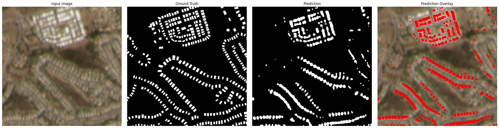
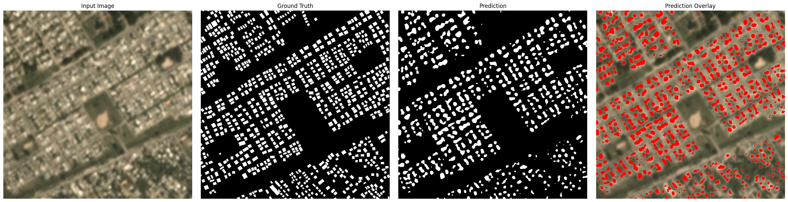
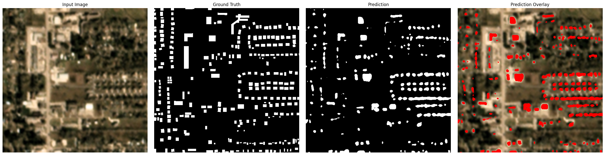

# SpaceNet 7 Building Segmentation usng HRNet-W48

The SpaceNet 7 dataset contains multi-temporal satellite imagery with building footprint annotations across varying conditions. This project focuses on **detecting building footprints from satellite images** using a deep learning-based segmentation model.

We implement a **HRNet-W48 model** to predict building masks from 4-channel satellite imagery (RGB + NIR) of 4 meter resolution.

---

## Approach

The pipeline follows a standard segmentation workflow:

1. Load satellite image and ground truth mask
2. Pass image through HRNet model
3. Generate pixel-wise predictions
4. Convert predictions to binary masks
5. Visualize results and overlays

---

## 🔍 Results

Below are sample predictions from the model:

### Example 1



### Example 2



### Example 3



Each example shows:

* Input satellite image
* Ground truth building mask
* Predicted segmentation
* Overlay (predictions in red)

---

## I. Data Setup

Download SpaceNet 7 dataset from AWS:

```bash
cd /local_data/sn7/
aws s3 cp s3://spacenet-dataset/spacenet/SN7_buildings/tarballs/SN7_buildings_train.tar.gz .
```

Place data in:

```bash
train/dataset_spacenet.py
```

---

## II. Environment Setup

```bash
pip install torch torchvision numpy matplotlib rasterio
```

Supports:

* CPU
* GPU (CUDA)
* Apple Silicon (MPS)

---

## III. Data Preparation

Dataset is handled using:

```python
SpaceNetDataset
```

Includes:

* Multi-channel image loading
* Mask loading
* Train/test splits

---

## IV. Training

Run:

```bash
python train/train_hrnet_sn7.py
```

Model checkpoints saved in:

```bash
.gitignore
```

---

## V. Inference

Run:

```bash
evaluation.ipynb
```

This performs:

* Model loading
* Prediction on test images
* Visualization of outputs

---

## VI. Output

The model generates:

* Binary segmentation masks
* Overlay visualizations
* Saved predictions

Stored in:

```bash
samples_predictions/
```

---

## Notes

* Ensure weights exist:

```bash
.gitignore
```

---


## Future Work

* Add IoU / Dice score evaluation
* Convert masks to polygons
* Extend to temporal tracking
* Improve training with augmentation

---

## About

This project demonstrates a **deep learning approach for building segmentation from satellite imagery**, leveraging HRNet for maintaining high-resolution spatial features.

---
